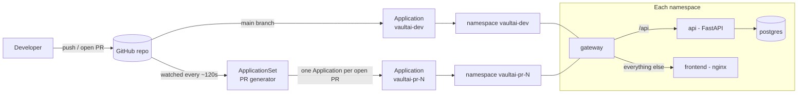

# VaultAI: GitOps with Argo CD and per-PR preview environments

A FastAPI + React app (with Postgres) deployed to a local Kubernetes cluster (minikube) using **Argo CD**. Git is the source of truth for the cluster, and every open pull request automatically gets its own isolated preview environment, which is deleted when the PR is closed.

## What this demonstrates

- **GitOps deployment:** a push to `main` changes the cluster, with no `kubectl apply` by hand.
- **Self-healing:** manual changes to the cluster are reverted to match Git.
- **Ephemeral preview environments:** an Argo CD **ApplicationSet with the Pull Request generator** creates one namespace per open PR and removes it when the PR closes.
- **One Helm chart, many environments:** the same chart serves `dev` and every PR preview.

## Architecture



Each environment runs four pods: **gateway** (routes `/api` to the API and everything else to the frontend), **frontend**, **api** and **postgres**.

## Repo layout

```
charts/vaultai-preview/     Helm chart used by every environment
gitops/
  application-dev.yaml          Application for the long-lived dev environment (tracks main)
  applicationset-pr-previews.yaml   ApplicationSet + PR generator (one app per open PR)
  appproject-previews.yaml      AppProject that scopes what previews may deploy
scripts/                    Numbered helper scripts (build, install, demo, teardown)
docs/                       Supporting notes
```

## How it works

**Dev environment.** `application-dev.yaml` points Argo CD at `charts/vaultai-preview` on `main`, with automated sync (`prune: true`, `selfHeal: true`). Anything merged to `main` is applied automatically.

**PR previews.** `applicationset-pr-previews.yaml` uses the Pull Request generator. Argo CD polls GitHub for open PRs, generates an Application for each one, and deploys the chart into a namespace named `vaultai-pr-<number>`. When the PR is closed, the Application is pruned and the namespace is deleted with it.

## Run it locally

Prerequisites: Docker, minikube, kubectl, git. About 4 GB of free RAM is enough for dev plus one preview. Update the repository URL in `gitops/*.yaml` to your own fork before running.

```bash
./scripts/30-all-in-one.sh
```

This checks tools, starts minikube, builds the images inside minikube, pushes the chart to GitHub, installs Argo CD and deploys the dev app. It is safe to re-run. Add `--previews` to also set up PR previews (needs a GitHub fine-grained token with read access to Contents and Pull requests).

Then open each in its own terminal (they are `kubectl port-forward` tunnels):

```bash
./scripts/22-argocd-ui.sh            # Argo CD UI  -> https://localhost:8080
./scripts/26-preview-open.sh dev     # dev app     -> http://localhost:9000
./scripts/26-preview-open.sh 1 9001  # PR #1       -> http://localhost:9001
```

| Script | Purpose |
|---|---|
| `10-minikube-build.sh` | Build the two images inside minikube |
| `20-preflight.sh` | Check the environment before installing |
| `21-argocd-install.sh` | Install Argo CD |
| `22-argocd-ui.sh` | Port-forward the Argo CD UI |
| `23-argocd-github-token.sh` | Store the GitHub token for the PR generator |
| `24-argocd-apply.sh` | Apply the dev app / ApplicationSet |
| `25-demo-pr.sh` | Push a demo branch to try a preview |
| `26-preview-open.sh` | Port-forward an environment's gateway |
| `27-argocd-teardown.sh` | Remove Argo CD and the environments |

## Verified behaviour

| Test | Result |
|---|---|
| Deploy dev app via Argo CD | `Synced` / `Healthy`, 4 pods running |
| `kubectl scale deploy/api --replicas=3` (manual drift) | Argo CD reverted it to 1 within seconds (self-heal) |
| Change `api.replicas` to 2 in `values.yaml`, push to `main` | Second API pod created automatically |
| Revert the change through Git | Extra pod removed automatically (prune) |
| Open a pull request | `vaultai-pr-1` namespace with its own 4 pods created |
| Close the pull request | Namespace and all its resources deleted automatically |

## Screenshots

Add screenshots here: the Argo CD application tree, the self-heal test, and PR #1 with its preview namespace.

## Known limitations and next steps

- **Previews use the `:local` image tag.** All environments run the same images built inside minikube, so a preview does not reflect code changes on the PR branch. A production setup builds one image per commit in CI, pushes it to a registry, and passes the tag (for example the PR head SHA) into the chart through the ApplicationSet template.
- **No External Secrets Operator yet.** Secrets are not synced from an external store such as Vault or AWS Secrets Manager. That would be the way to give each preview its own credentials without putting them in Git.
- **No per-preview observability.** Logs and metrics are not labelled or dashboarded per PR.
- **Closing a PR was tested, merging was not.** Both remove the PR from the generator's list, so the teardown mechanism is the same.
- **PR detection polls about every 2 minutes.** A GitHub webhook to Argo CD would make it near-instant.
- **App-of-Apps** is not used. The dev Application and the ApplicationSet are applied directly by script.

## Teardown

```bash
./scripts/27-argocd-teardown.sh
```
